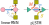

# pLSTM

This repository contains the pLSTM (parallelizable Linear Source Transition Mark networks) implementations.



## Configuration

All layers within pLSTM can be configured using the config classes in `plstm.config` composed by way of `compoconf` library.

## Framework Implementations

pLSTM offers implementations across multiple popular deep learning frameworks:
- `nnx`
- `linen`
- `torch`


## Graph Implementation

Please note that `plstm_graph` is currently only implemented in `torch`.


## License

MIT License

## Citation

If you use this dataset in your research, please cite:

```bibtex

@misc{poppel_plstm_2025,
	title = {{pLSTM}: parallelizable {Linear} {Source} {Transition} {Mark} networks},
	shorttitle = {{pLSTM}},
	url = {http://arxiv.org/abs/2506.11997},
	doi = {10.48550/arXiv.2506.11997},
	urldate = {2025-06-16},
	publisher = {arXiv},
	author = {Pöppel, Korbinian and Freinschlag, Richard and Schmied, Thomas and Lin, Wei and Hochreiter, Sepp},
	month = jun,
	year = {2025},
	note = {arXiv:2506.11997 [cs]},
	keywords = {Computer Science - Machine Learning, Statistics - Machine Learning},
}

```
